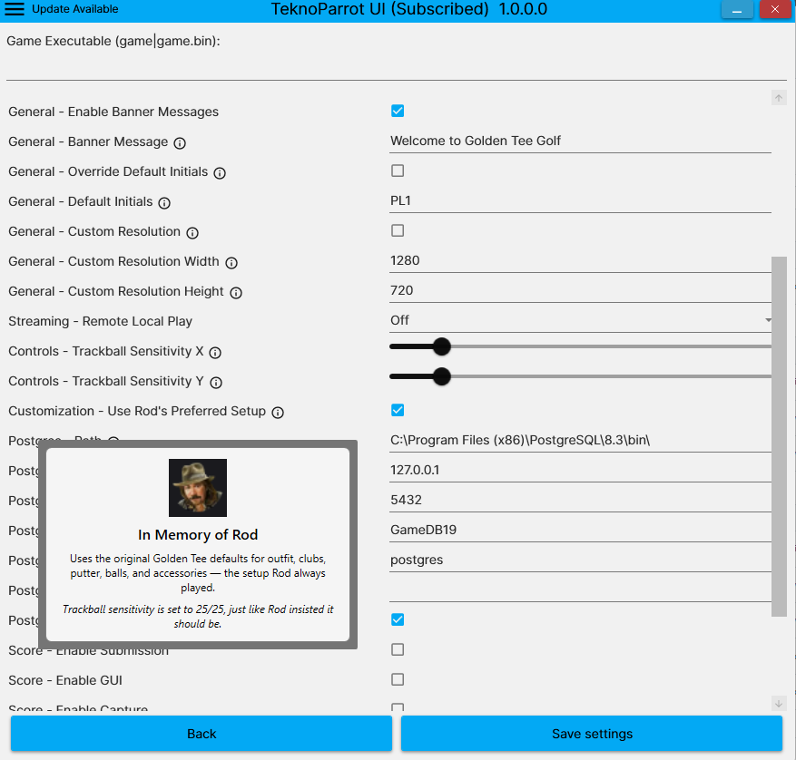

# In Memory of Rod

This branch includes a small Golden Tee tribute in memory of Rod.

## Rod's Preferred Setup

A new **Use Rod's Preferred Setup** option has been added to the Golden Tee configuration screen.

When enabled, the UI applies the setup Rod always preferred to play with:

- Uses the original Golden Tee defaults for outfit, clubs, putter, balls, and accessories
- Sets trackball sensitivity to **25 / 25**
- Locks trackball sensitivity while Rod's preferred setup is enabled
- Applies the preferred setup only to the applicable Golden Tee games
- Displays the **In Memory of Rod** tribute in the configuration screen

The intent is to preserve the way Rod liked Golden Tee configured and provide an easy way for players to use his preferred setup.

## In Memory of Rod

> Uses the original Golden Tee defaults for outfit, clubs, putter, balls, and accessories — the setup Rod always played.
>
> Trackball sensitivity is set to 25/25, just like Rod insisted it should be.

## Screenshot

